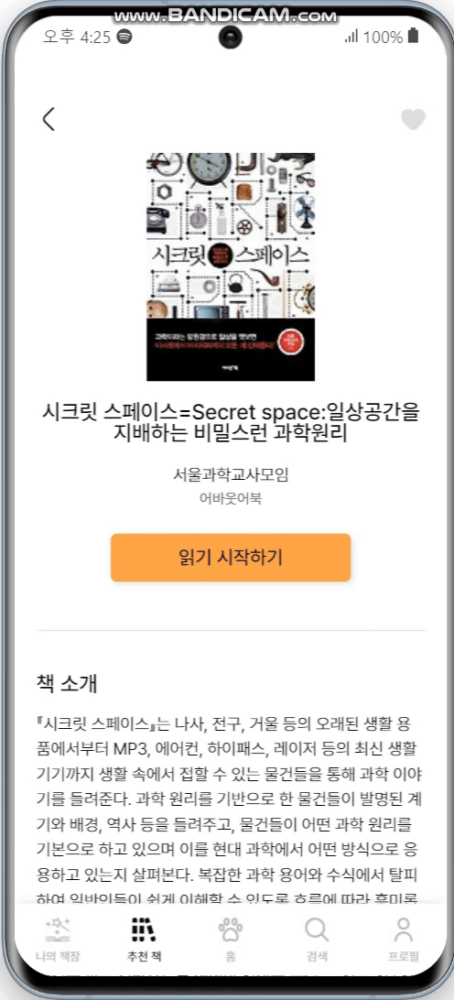

#  책 먹는 여우 

#  프로젝트 개요
### 1. 기간

2024.08.26 - 2024.10.11 | 총 7주

### 2. 팀원

| 백하람 (프론트, 팀장)| 오예진 (프론트)| 김예원 (프론트)| 박찬호 (백엔드, 인프라)| 이건희 (백엔드)| 김미량 (빅데이터)|
|---|---|---|---|---|---|
|  |  |  |  |  |  |
| [@ramrami-B](https://github.com/ramrami-B)| [@ooyejinn](https://github.com/ooyejinn)| [@yewone1](https://github.com/yewone1)| [@Chaeros](https://github.com/Chaeros)| [@GeonHui2](https://github.com/GeonHui2)| [@miryang1016](https://github.com/miryang1016)|

### 3. 프로젝트 개요
빅데이터 기반 도서 추천 기능 및 독서 기록 관리 기능이 있는 모바일 웹앱

### 4. 기술 스택

**백엔드**

  

**프론트엔드**

**인프라**

**빅데이터**

#  기능 및 화면
### 1. 로그인/회원가입

  
  

- 카카오, 구글, 네이버 소셜 로그인이 가능합니다. 
  
### 2. 홈 화면

- 독서 현황을 여우의 상태로 보여줍니다. 
  - 1시간 내로 밥을 주지 않으면 여우가 배고파합니다.(BAD) 
  - 밥 주기를 통해 경험치와 상태를 변경할 수 있습니다.(GOOD) 
  - 경험치 조건을 만족하면 레벨이 올라갑니다. 
  - 특정 레벨마다 여우가 성장합니다  
 - 독서 캘린더를 통해 일자마다 읽은 페이지 수를 알 수 있습니다. 
  - 많은 페이지를 읽을 수록 캘린더의 색이 진해집니다. 
  - 완독한 책의 분아별 통계를 보여줍니다. 
  - 완독한 책의 줄거리를 워드 클라우드로 볼 수 있습니다. 
  - 월간 독서 시간을 차트로 확인할 수 있습니다. 
    
### 3. 추천 책

- 협업 필터링을 통해 선택한 태그의 책들을 추천합니다. 
- 연령과 성별에 따른 인기 도서를 추천합니다. 
  
### 4. 책 상세 보기

- 다른 유저의 리뷰를 볼 수 있습니다. 
- 책 줄거리를 기반으로 유사한 책들을 추천합니다. 
- 내 책장에 해당 도서를 추가할 수 있습니다. 
  
### 5. 나의 책장

- 도서들을 읽는 중/완독한 책/찜한 책으로 관리할 수 있습니다. 
  
### 6. 나의 책장 - 읽는 중

- 몇 페이지 읽고 있었는지 기록할 수 있습니다. 
- 현재 페이지와 함게 메모를 기록할 수 있습니다. 
- 스톱워치를 활용해 총 독서 시간이 어떻게 되는지 기록할 수 있습니다. 
  
### 7. 나의 책장 - 완독한 책

- 별점과 함께 나의 리뷰를 작성 및 조회할 수 있습니다. 
- 독후감을 기록할 수 있습니다. 
  
### 8. 제목 검색

- 책의 제목을 키워드로 검색할 수 있습니다. 
  
### 9. 바코드 검색

- PWA로 핸드폰 카메라 기능을 연결하여 바코드로 책을 검색할 수 있습니다. 
  
### 10. 마이페이지

- 유저의 닉네임, 프로필 사진, 성별, 생일, 관심사 키워드 등을 변경할 수 있습니다. 
- 로그아웃 및 회원탈퇴를 할 수 있습니다. 

#  빅데이터 알고리즘

### 1. 협업 필터링(User-Based Collaborative Filtering)
특정 사용자와 유사한 취향을 가진 다른 사용자들의 행동 데이터를 바탕으로 추천하는 알고리즘

### 2. 콘텐츠 필터링(TF-IDF)
정보 검색과 텍스트 마이닝에서 사용되는 기법으로, 특정 단어가 문서 내에서 얼마나 중요한지를 평가하는 데 사용되는 알고리즘

#  시스템 아키텍처

#  ERD

